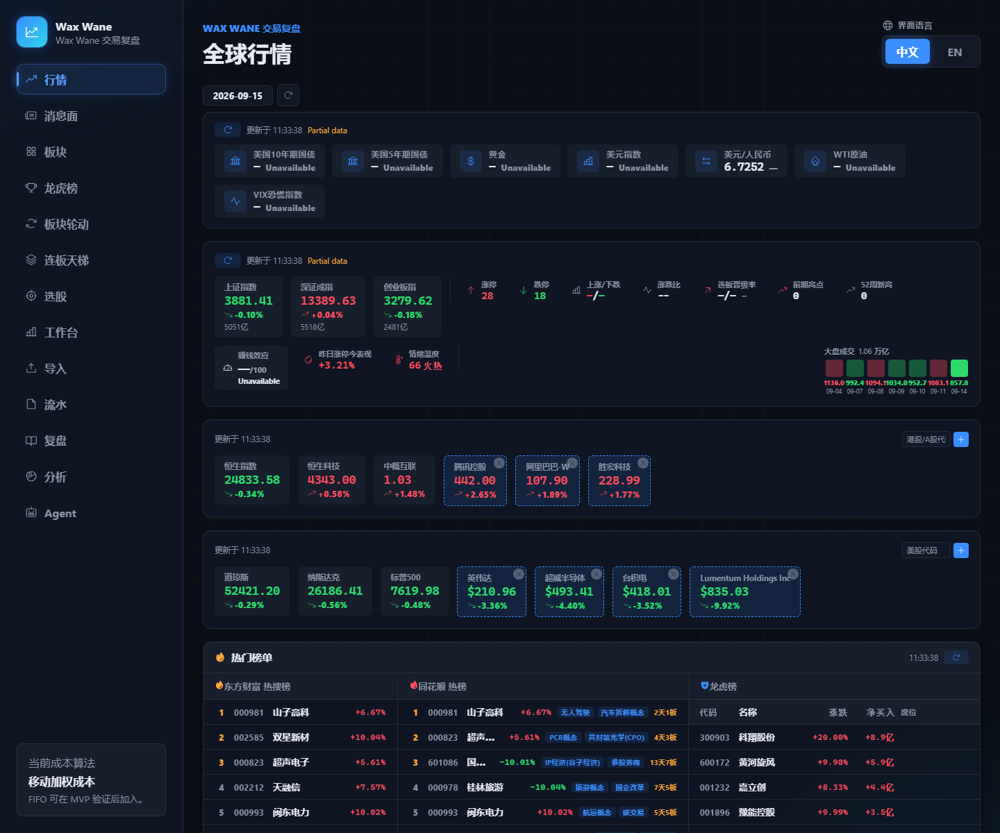
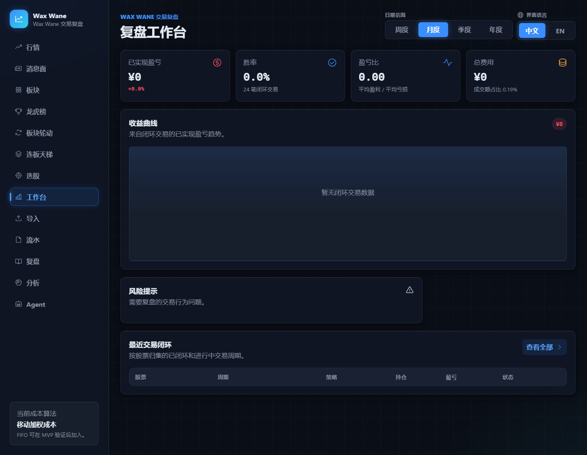
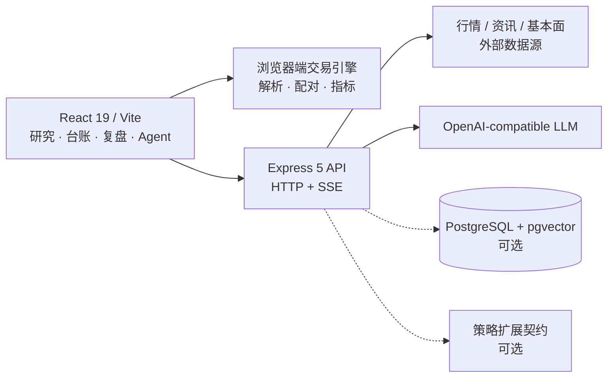

# Wax Wane

> 面向个人投资者的本地交易研究与复盘工作台。把多市场信息、交割单、交易台账、量化统计和 AI 辅助复盘放进同一套可追溯流程。

[](https://github.com/xzy025/wax-wane/actions/workflows/ci.yml)


Wax Wane 覆盖 A 股、港股和美股的研究信息聚合，并围绕一笔交易的完整生命周期组织数据：导入成交记录、还原持仓与盈亏、形成复盘笔记、统计交易表现，再由 AI Agent 调用行情、交易、知识库和分析工具生成结构化结论。

## 界面预览



_多市场行情、指数、情绪指标与热门榜单。截图中的行情仅用于界面演示。_



_复盘工作台的指标、收益曲线、风险提示与近期交易区域；截图使用空交易数据。_

## 主要能力

| 模块 | 能力 |
| --- | --- |
| 市场研究 | A 股 / 港股 / 美股概览、资讯、主题、资金流、市场情绪和连板天梯 |
| 交易记录 | CSV / Excel 交割单解析、买卖配对、持仓还原、交易分组和复盘笔记 |
| 绩效分析 | 资金曲线、胜率、盈亏比、R 倍数、持仓周期和行为模式统计 |
| AI 辅助 | ReAct 工具调用循环、SSE 流式输出、可中断会话、结构化复盘和个股分析 |
| 多 Agent | 宏观、消息、市场、板块、基本面、技术与交易理论等角色协作，并由 Synthesizer 汇总 |
| 知识与记忆 | 交易历史语义检索、BM25 + 向量混合检索、GraphRAG、长期记忆与行动项 |
| 多语言 | 中文 / English 界面切换 |

AI、数据库和部分外部数据源采用渐进增强：未配置 LLM 时 AI 功能不可用；PostgreSQL 不可用时服务以有限模式启动；外部数据源失败时相应卡片会显示错误或降级结果。

## 公开版本边界

本仓库包含可独立构建和启动的公开宿主、通用交易复盘能力、市场数据适配和扩展契约。选股器、板块轮动以及带有专有阈值或评分规则的策略面板通过可选策略包挂载；未安装时对应路由显示占位状态，其他公开功能仍可使用。

所有研究输出都保持 `research-only` 属性，只用于辅助核验和复盘，不会自动执行交易，也不会成为实盘准入条件。

### 本地私有研究工作区

项目的完整研究环境还使用下列本地目录。它们被 `.gitignore` 排除，不随公开仓库分发；README 只公开目录边界，不公开其中的第三方原文、作者截图、个人交易数据或推导细节。

| 本地路径 | 用途 | 公开仓库状态 |
| --- | --- | --- |
| `docs/n/` | 指标复刻、公式实验与逐轮验证记录 | 不分发 |
| `docs/v13-research/` | 原始证据、逐 bar 核验、复现工具与量化验证产物 | 不分发 |
| `docs/妖股形态/` | 第三方形态图片资料库 | 不分发 |
| `server/knowledge/teacher/` | 第三方课程转录与派生知识材料 | 不分发 |
| `skills/analyze-huishou-trading/` | 本地研究分析 skill 的单一事实来源 | 不分发 |
| `huishou-research.html` | 私有研究控制台入口 | 不分发 |

当前本地快照的可验证锚点（2026-09-19）：

- `docs/v13-research/quant-validation-v1/HANDOFF-TO-REVIEWER.md`：SHA-256 `D63292E5F55C0DC6BB5F9B7B49A48251EA7257320892EF6EE5310E7806837A7A`
- `skills/analyze-huishou-trading/SKILL.md`：`verdict-rev: 2026-09-13`，SHA-256 `942F38CDFF3F1221E9B610D77E46478E7F1DBE608413BCD033F37DB69113DBD7`

## 架构



- 前端负责界面、交割单解析、交易分组、本地状态和 Agent 交互。
- 后端统一代理模型与外部数据请求，提供交易、记忆、分析、RAG 和图谱 API。
- LLM 密钥只保存在 `server/.env`，不会下发到浏览器。
- PostgreSQL + pgvector 为交易持久化、向量检索和 GraphRAG 提供增强能力；缺失时后端仍可启动。

更完整的 Agent 设计见 [AI 系统架构](docs/AI-ARCHITECTURE.md)。

## 快速开始

### 环境要求

- Node.js 22
- npm
- PowerShell（仅 `npm run start:local` 需要）
- PostgreSQL + pgvector（可选，用于数据库、RAG 和 GraphRAG）

### Windows 一键启动

```powershell
git clone https://github.com/xzy025/wax-wane.git
cd wax-wane

npm ci
npm ci --prefix server
Copy-Item server/.env.example server/.env

# 编辑 server/.env，至少为 AI 功能填写 LLM_API_URL、LLM_API_KEY 和 LLM_MODEL
npm run start:local
```

启动完成后访问 <http://localhost:3000>。后端默认监听 <http://localhost:3002>。

`start:local` 会检查两个端口，只补齐尚未运行的前后端进程；启动日志写入 `.runtime/`。

### 分别启动前后端

适合 macOS、Linux，或需要监听代码变更的开发场景：

```bash
cp server/.env.example server/.env

# 终端 1：Express API，端口 3002
npm --prefix server run dev

# 终端 2：Vite，端口 3000
npm run dev
```

前端会把 `/api` 代理到 `http://127.0.0.1:3002`。如需连接其他后端，可设置 `VITE_API_TARGET`。

## 配置

核心配置模板见 [`server/.env.example`](server/.env.example)；服务端读取的常用变量如下：

| 变量 | 用途 | 是否必需 |
| --- | --- | --- |
| `LLM_API_URL` | OpenAI-compatible 聊天接口地址 | 仅 AI 功能需要 |
| `LLM_API_KEY` | 服务端模型密钥 | 仅 AI 功能需要 |
| `LLM_MODEL` | 模型名称 | 仅 AI 功能需要 |
| `EMBEDDING_MODEL` | RAG 使用的向量模型 | 可选 |
| `PG_HOST` / `PG_PORT` | PostgreSQL 地址 | 数据库能力需要 |
| `PG_DATABASE` / `PG_USER` / `PG_PASSWORD` | PostgreSQL 连接信息 | 数据库能力需要 |
| `CORS_ORIGINS` | 额外允许的前端来源，逗号分隔 | 可选 |
| `WAX_WANE_STRATEGY_DIR` | 可选策略扩展目录 | 可选 |

不要提交 `server/.env` 或任何真实密钥。

## 开发与验证

```bash
npm run lint              # ESLint：src/ + server/
npm run typecheck:server  # 后端 TypeScript 检查
npm test                  # 前端与浏览器端逻辑测试
npm run test:server       # 后端测试
npm run build             # 生产构建
```

GitHub Actions 在 Node.js 22 上依次执行依赖安装、lint、后端类型检查、前后端测试和生产构建。CI 配置见 [`.github/workflows/ci.yml`](.github/workflows/ci.yml)。

## 目录结构

```text
src/
├── agent/          ReAct Agent、工具注册表和多 Agent 编排
├── engine/         CSV / Excel 解析、买卖配对和交易分组
├── views/          市场研究、交易记录、分析与 Agent 页面
├── components/     共享界面组件
├── hooks/          行情、资讯、RAG 与图谱数据 hooks
├── store/          应用状态与持久化适配
├── strategy-ui/    可选策略面板的前端挂载点
└── utils/          指标计算与缓存工具

server/
├── routes/         Express API
├── services/       市场、资讯、基本面和调度服务
├── db/             PostgreSQL 持久化
├── rag/            Embedding、向量检索与同步
├── graph/          GraphRAG 图结构
├── memory/         用户记忆与行动项
├── strategy/       可选策略包契约与加载器
└── observability/  Agent 运行追踪

mcp-servers/        面向外部 MCP 客户端的独立 stdio server
docs/               架构、API 与工程文档
scripts/            本地启动和数据维护脚本
```

## 文档

- [AI 系统架构](docs/AI-ARCHITECTURE.md)
- [REST API 参考](docs/api/README.md)
- [OpenAPI 3.1 规范](docs/api/openapi.yaml)
- [外部 MCP servers 与实现状态](mcp-servers/README.md)

`mcp-servers/` 是供外部 MCP 客户端使用的独立适配层，应用本身直接调用 `server/services/`。各 MCP 工具的真实实现或占位状态以其 README 为准。

## 使用说明

行情、新闻和基本面数据来自第三方公开接口，可能受交易日、网络、限流和上游字段变更影响。界面展示与 AI 输出应结合原始数据复核。本项目用于个人研究、工程实验与交易复盘，不构成投资建议。
