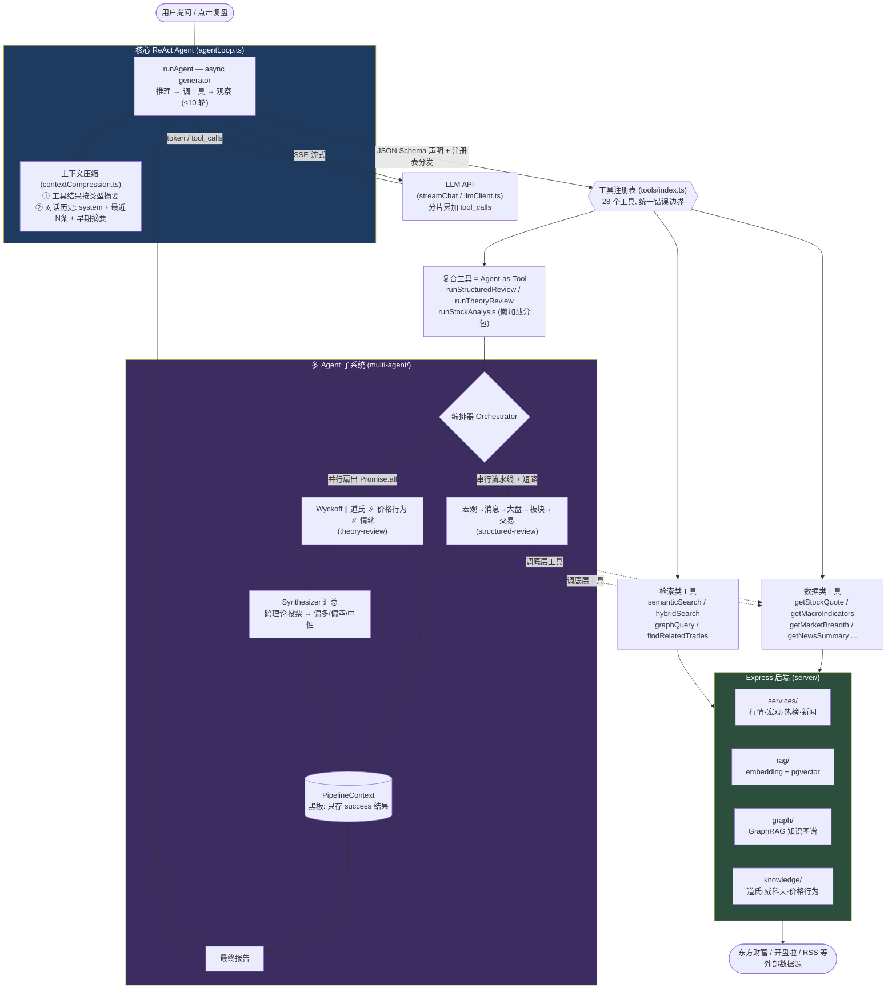
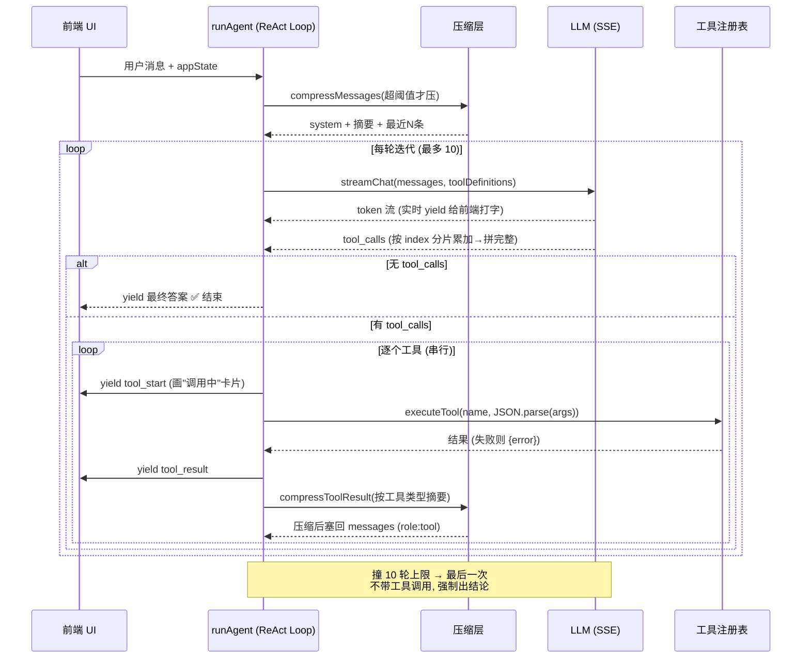

# AI 系统架构 — TradeReview

本文档拆解 TradeReview 的 AI 子系统:一个自研的 ReAct Agent、function-calling 工具系统、两层上下文压缩,以及在其之上的多 Agent 编排。

> 代码位置:`src/agent/`(前端 Agent 编排)+ `server/`(Express 数据 / RAG / 知识图谱)

---

## 1. 整体架构



**关键洞察:多 Agent 子系统对主 Agent 是透明的。** 它被包装成普通工具(`runStockAnalysis` 等)暴露给主 ReAct Agent——主 Agent 只看到"调了个工具,拿回一份报告",不知道背后是 N 个 Agent 协作。这就是 **Agent-as-Tool** 模式。

---

## 2. ReAct 循环

ReAct = Reason + Act:模型先推理决定调用工具(Act),拿到结果(Observation)再继续推理,循环直到能给出最终答案。

实现是一个 `async generator` 的 while 循环(`agentLoop.ts` `runAgent`):

```
循环 (最多 MAX_ITERATIONS = 10 轮):
  1. 把 messages 丢给 LLM,流式拿回 content + tool_calls
  2. 无 tool_calls → 模型认为可收尾 → yield 最终答案, return
  3. 有 tool_calls → 逐个执行, 结果以 role:'tool' 塞回 messages
  4. 回到第 1 步, 带着工具结果再问一次
```



### 设计要点

- **为什么用 `async generator`(`yield`):** 边推理边把过程吐给前端——`yield {type:'token'}` 实时打字,`yield {type:'tool_start'/'tool_result'}` 让前端画"正在调用 XX 工具"的卡片。Agent 的"思考过程可见"由此而来。
- **如何结束:** 不靠固定轮数,而是**模型不再返回 tool_calls** 就停——模型自己判断"信息够了"。
- **10 轮兜底:** 防止反复调工具陷入死循环、烧 token。撞上限后做**最后一次不带工具的调用**,强制"基于已有数据给结论",而不是硬断在半截。
- **可中断:** 每一步 `signal?.throwIfAborted()`,用户点停止立刻退出,`AbortError` 静默 return。

---

## 3. 工具调用协议

本质是复刻 OpenAI function-calling 协议,分三层。

### ① 工具定义(声明给模型看)

每个工具是 `ToolModule = { schema, execute }`(见 `tools/getStockQuote.ts`):
- `schema` 是 JSON Schema,描述名字、用途、参数。`description` 写得很细("Use when the user asks about a specific stock's price")——**这是模型选对工具的关键**,prompt engineering 就在这里。
- `toolDefinitions`(`tools/index.ts`)收集所有 schema 成数组,随每次请求发给 LLM。

### ② 注册表 + 分发(`tools/index.ts`)

- `toolRegistry` 是 `Record<name, ToolModule>`,**新增工具只要加一行**(目前 28 个工具)。
- `executeTool` 按名字查表执行,**统一 try/catch**:工具抛错不会让 Agent 崩,而是返回 `{error: ...}` 让模型看到错误、重试或换路——错误边界清晰。

### ③ 流式解析协议(`llmClient.ts`)

- 后端用 SSE 推 `data: {...}` 行,前端 `getReader()` 逐块读,`TextDecoder` 解码,按 `\n` 切行,`buffer = lines.pop()` 把不完整的最后一行留到下一轮——处理 TCP 分包的标准手法。
- **难点:tool_calls 是分片流式传来的。** 一个工具调用的 `arguments`(JSON 字符串)被拆成很多 delta。用 `toolCallAccumulator: Map<index, ...>` **按 index 累加拼接** `arguments`,直到 `[DONE]` 才组装成完整 ToolCall。
- 完整 arguments 在 agentLoop 里 `JSON.parse` 成参数对象传给 `execute`。

---

## 4. 上下文压缩策略

**问题:** Agent 多轮调工具后,返回的 JSON(行情、新闻、历史交易)体积巨大,几轮就把 context window 撑爆 / token 烧光。解法是两层压缩(`contextCompression.ts`)。

### 第 1 层:工具结果压缩(`compressToolResult`)

每个工具返回后立刻压一遍再入 context(在 agentLoop 中调用):
- < 500 字符 → 原样保留。
- **针对不同工具的专门规则**(`TOOL_COMPRESSORS`):
  - `queryTradeHistory`:几百条交易 → 只留 `totalTrades` + 前 3 条样本 + "还有 N 条"。
  - `semanticSearch`:每条 content 截断到 200 字。
  - `getMacroIndicators`:只挑关键字段(10Y 美债、黄金、VIX…)。
  - `getStockQuote` 本身就小 → 不动。
- 无专门规则 → 默认截断到 800 字符。

洞察:**模型不需要原始数据全文,只需要"足够做判断的摘要"。**

### 第 2 层:对话历史压缩(`compressMessages`)

对话超过 `targetTokens = 4000` 才触发:
- **System prompt 永远保留。**
- **最近 6 条消息原样保留**(近因最重要)。
- **更早的消息压成摘要**(`buildSummary`):提取"用户问过什么 + 关键分析结论 + 调用过哪些工具"。
- agentLoop 中重组为:`[system prompt] + [对话摘要] + [最近消息]`。
- `scoreMessage` 给消息按角色 + 近因打分(user 40 分、带 tool_calls 的 assistant +20、越近分越高),决定保留优先级。

---

## 5. 多 Agent 编排

### SubAgent 抽象:模板方法模式(`base.agent.ts`)

每个专家 Agent 实现 `SubAgent` 接口:`{ id, name, stepName, execute(context) }`。
`BaseAgent` 用**模板方法模式**——`execute()` 写死流程骨架,子类只填三个钩子:
- `toolName`:调哪个底层工具
- `getToolArgs(context)`:怎么构造参数
- `postProcess(result)`:怎么把结果整理成给下一环看的文本

`MacroAnalystAgent` 整个类约 30 行。`execute()` 统一封装:计时(`duration`)、统一 try/catch(单 Agent 失败返回 `success:false`,不拖垮全局)、lazy import `executeTool` 打破循环依赖。**加专家 Agent 几乎零样板。**

### 两种编排模式

**模式 A — 串行流水线(`structured-review.orchestrator.ts`):**
宏观 → 消息 → 大盘 → 板块 → 交易复盘,for 循环顺序跑。
- 为什么串行:复盘的逻辑顺序,后面步骤依赖前面结论(自上而下)。每个 Agent 拿到 `context.results` 是前面所有 Agent 的累积结果。
- **短路:** 某步 `success:false` 就中断整个流程(缺了宏观面,后面分析没意义)。

**模式 B — 并行扇出 + 汇总(`theory-review.orchestrator.ts`):**
Wyckoff / 道氏 / Al Brooks / 情绪 四个理论 Agent 同时跑,然后 Synthesizer 汇总。
- 为什么并行:四个理论框架彼此独立,互不依赖。`Promise.all` 同时发起,**墙钟时间从"四个之和"压缩到"最慢的一个"**(fan-out / fan-in)。

> 选哪种取决于子任务之间有没有数据依赖。

### 共享上下文:PipelineContext = 黑板模式(`pipeline/context.ts`)

- 内部 `Map<stepName, content>` 存每个 Agent 产出。
- `addResult()`:**只有 success 的结果才写进 results**——失败的不污染后续上下文。
- `getAllResults()` 传给下一个 Agent 当输入。
- 顺带统计 `getDuration / getSuccessCount`(可观测性)。

### Synthesizer:汇总 Agent(`synthesizer.agent.ts`)

并行扇出后需要收口的环节。Synthesizer 从黑板读 4 个理论结论,做轻量**跨理论投票**:统计多空关键词(上涨/吸筹/修复 vs 下跌/派发/退潮),多者得出"偏多/偏空/中性"。

> 已知权衡:这是关键词计数的启发式,不是再过一遍 LLM 做语义综合。改进方向是让 LLM 基于四份结论二次推理。

### 工程化:编排器懒加载

`runStockAnalysis.ts` 用 `await import(...)` 把整个多 Agent 子系统打成独立 chunk,**只在真正触发分析时才加载**,首屏不背这部分体积(对应 commit `b94ac96`)。

---

## 6. 技术栈速查

| 层 | 技术 |
|---|---|
| 前端 | React 19 · TypeScript 5.9 · Vite 7 · React Router 7 · Recharts |
| 后端 | Node.js · Express 5 · tsx (ESM) · PostgreSQL + pgvector · Redis |
| AI / 数据 | LLM API (SSE 流式) · RAG 向量检索 (Vectra / pgvector) · Embedding · GraphRAG · Multi-Agent 编排 |
| 测试 / 工程 | Vitest 4 + Testing Library (300 用例) · ESLint v10 + Prettier · 代码分包 / 懒加载 |
</content>
</invoke>
