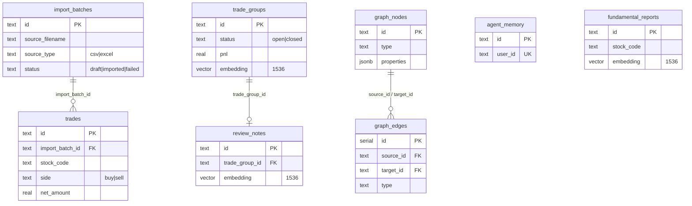

# Database Schema

> **现状(as-built):** 系统实现于 **PostgreSQL + pgvector**,共 **8 张表**。
> 唯一真相来源:`server/db/pgDatabase.ts`(6 张业务表)与 `server/graph/graphSchema.ts`(2 张图谱表)。
> 早期一份更规范化的 SQLite 设计草案保留在文末[附录](#附录原始设计草案未落地)作历史参考,但**未落地**。

要点:
- **持仓不落表** —— 仓位由 `src/engine/position.ts` 在内存中按移动加权成本重建,不持久化(故无 `position_snapshots`)。
- **向量内联** —— `trade_groups` / `review_notes` / `fundamental_reports` 各带一列 `embedding VECTOR(1536)`,语义检索用 `embedding <-> $query::vector`,不另设 `rag_documents` 表。
- **图谱用邻接表** —— GraphRAG 以 `graph_nodes` / `graph_edges` 通用邻接表存储,节点/边类型在应用层约束。
- **前端为本地优先** —— 浏览器侧状态存 `localStorage`(`src/store/persistence.ts`),后端 Postgres 为可选的写穿层(`isDbReady()` 为假时降级,仅本地可用)。

---

## ER 关系



---

## 业务表(`server/db/pgDatabase.ts`)

启动时执行 `CREATE EXTENSION IF NOT EXISTS vector` 再建表(`initDatabase()`)。

### import_batches — 一次交割单导入

```sql
CREATE TABLE import_batches (
  id TEXT PRIMARY KEY,
  source_filename TEXT NOT NULL,
  source_type TEXT NOT NULL CHECK (source_type IN ('csv', 'excel')),
  broker_name TEXT,
  account_alias TEXT,
  imported_at TEXT NOT NULL,
  row_count INTEGER NOT NULL DEFAULT 0,
  success_count INTEGER NOT NULL DEFAULT 0,
  error_count INTEGER NOT NULL DEFAULT 0,
  status TEXT NOT NULL CHECK (status IN ('draft', 'imported', 'failed')),
  mapping_json TEXT NOT NULL,
  notes TEXT
);
```

### trades — 标准化交易行

```sql
CREATE TABLE trades (
  id TEXT PRIMARY KEY,
  import_batch_id TEXT REFERENCES import_batches(id),
  trade_date TEXT NOT NULL,
  stock_code TEXT NOT NULL,
  stock_name TEXT NOT NULL,
  side TEXT NOT NULL CHECK (side IN ('buy', 'sell')),
  quantity INTEGER NOT NULL CHECK (quantity > 0),
  price REAL NOT NULL CHECK (price > 0),
  gross_amount REAL NOT NULL,
  commission REAL NOT NULL DEFAULT 0,
  stamp_tax REAL NOT NULL DEFAULT 0,
  transfer_fee REAL NOT NULL DEFAULT 0,
  other_fee REAL NOT NULL DEFAULT 0,
  net_amount REAL NOT NULL,
  validation_status TEXT NOT NULL DEFAULT 'valid',
  validation_message TEXT,
  raw_json TEXT NOT NULL,
  created_at TEXT NOT NULL,
  updated_at TEXT NOT NULL
);
CREATE INDEX idx_trades_date  ON trades(trade_date);
CREATE INDEX idx_trades_stock ON trades(stock_code, trade_date);
```

### trade_groups — 一只股票的完整/在持交易周期

```sql
CREATE TABLE trade_groups (
  id TEXT PRIMARY KEY,
  stock_code TEXT NOT NULL,
  stock_name TEXT NOT NULL,
  opened_at TEXT NOT NULL,
  closed_at TEXT,
  status TEXT NOT NULL CHECK (status IN ('open', 'closed')),
  pnl REAL NOT NULL DEFAULT 0,
  return_rate REAL,
  holding_days INTEGER,
  strategy TEXT,
  mistakes_json TEXT NOT NULL DEFAULT '[]',
  review_status TEXT NOT NULL DEFAULT 'not_reviewed',
  embedding VECTOR(1536),
  created_at TEXT NOT NULL,
  updated_at TEXT NOT NULL
);
CREATE INDEX idx_trade_groups_stock  ON trade_groups(stock_code);
CREATE INDEX idx_trade_groups_status ON trade_groups(status);
```

### review_notes — 每个交易分组的复盘笔记

```sql
CREATE TABLE review_notes (
  id TEXT PRIMARY KEY,
  trade_group_id TEXT NOT NULL REFERENCES trade_groups(id),
  buy_reason TEXT,
  sell_reason TEXT,
  execution_review TEXT,
  lesson TEXT,
  embedding VECTOR(1536),
  created_at TEXT NOT NULL,
  updated_at TEXT NOT NULL
);
CREATE INDEX idx_review_notes_group ON review_notes(trade_group_id);
```

### agent_memory — Agent 长期记忆(每用户一行)

```sql
CREATE TABLE agent_memory (
  id TEXT PRIMARY KEY,
  user_id TEXT NOT NULL UNIQUE,
  trading_profile_json TEXT NOT NULL,   -- 交易画像(风格/常犯错误/强弱项/理论盲区)
  improvement_plans_json TEXT NOT NULL, -- 改进计划数组
  market_analysis_json TEXT NOT NULL,   -- 大盘记忆(Wyckoff/道氏/情绪阶段)
  conversation_summary TEXT,
  last_updated TEXT NOT NULL
);
```

### fundamental_reports — 基本面研报存档(RAG)

```sql
CREATE TABLE fundamental_reports (
  id TEXT PRIMARY KEY,
  stock_code TEXT,
  stock_name TEXT,
  report_md TEXT,
  summary TEXT,
  created_at TEXT,
  embedding VECTOR(1536)
);
CREATE INDEX idx_fundamental_stock ON fundamental_reports(stock_code);
```

---

## 图谱表(`server/graph/graphSchema.ts`)

GraphRAG 用通用邻接表,启动时 `initGraphSchema()` 建表。

### graph_nodes

```sql
CREATE TABLE graph_nodes (
  id TEXT PRIMARY KEY,
  type TEXT NOT NULL,                 -- EntityType
  properties JSONB NOT NULL DEFAULT '{}',
  created_at TIMESTAMPTZ NOT NULL DEFAULT NOW(),
  updated_at TIMESTAMPTZ NOT NULL DEFAULT NOW()
);
CREATE INDEX idx_graph_nodes_type ON graph_nodes(type);
```

### graph_edges

```sql
CREATE TABLE graph_edges (
  id SERIAL PRIMARY KEY,
  source_id TEXT NOT NULL REFERENCES graph_nodes(id) ON DELETE CASCADE,
  target_id TEXT NOT NULL REFERENCES graph_nodes(id) ON DELETE CASCADE,
  type TEXT NOT NULL,                 -- RelationType
  properties JSONB NOT NULL DEFAULT '{}',
  created_at TIMESTAMPTZ NOT NULL DEFAULT NOW()
);
CREATE INDEX idx_graph_edges_source      ON graph_edges(source_id);
CREATE INDEX idx_graph_edges_target      ON graph_edges(target_id);
CREATE INDEX idx_graph_edges_type        ON graph_edges(type);
CREATE INDEX idx_graph_edges_source_type ON graph_edges(source_id, type);
CREATE INDEX idx_graph_edges_target_type ON graph_edges(target_id, type);
CREATE UNIQUE INDEX idx_graph_edges_unique ON graph_edges(source_id, target_id, type);
```

**EntityType:** `TradeGroup · Stock · Sector · Mistake · Strategy · Theory · MarketPhase · Lesson · Pattern · User · MacroIndicator · NewsEvent`

**RelationType:** `BELONGS_TO · INVOLVES · HAS_MISTAKE · USED_STRATEGY · OCCURRED_DURING · GENERATED · VIOLATES · APPLIES_TO · LINKED_TO · PRONE_TO · FOLLOWS · IN_SECTOR · CORRELATED_WITH · CHARACTERIZED_BY · AFFECTS`

---

## 算法规则(仍然有效)

### 移动加权成本 PnL

买入:

```text
new_quantity   = old_quantity + buy_quantity
new_cost_basis = old_cost_basis + gross_amount + fees
new_avg_cost   = new_cost_basis / new_quantity
realized_pnl_delta = 0
```

卖出:

```text
cost_removed = old_avg_cost * sell_quantity
sell_proceeds = gross_amount - fees
realized_pnl_delta = sell_proceeds - cost_removed
new_quantity   = old_quantity - sell_quantity
new_cost_basis = old_avg_cost * new_quantity
```

`new_quantity = 0` 时,`new_avg_cost` 与 `new_cost_basis` 归零。

### 交易分组规则

- 按 `trade_date` + 源行序排序。
- 持仓从 `0` → 正,开新分组。
- 该股后续交易归入当前活动分组。
- 持仓回到 `0`,分组关闭。
- 卖出超过当前持仓 → 标 error,在修正前不参与分组。

---

## 附录:原始设计草案(未落地)

> 以下是早期面向 SQLite 的规范化设计,包含 `position_snapshots`、`trade_group_items`、
> `tags` / `review_note_tags`、`market_quotes`、`report_snapshots`、`rag_documents` 等表。
> 实际实现走了"持仓内存重建 + 向量内联 + 图谱邻接表"的更精简路线,这些表**均未建**。
> 保留于此仅记录设计意图(如标签体系、报表快照),未来若需扩展可参考。

<details>
<summary>展开原始 SQLite 设计</summary>

- `position_snapshots`:每笔交易后的持仓快照(已改为内存重建)。
- `trade_group_items`:交易行 ↔ 分组的关联表(现由 engine 内存计算)。
- `tags` / `review_note_tags`:策略/错误/情绪标签体系(现简化为 `trade_groups.strategy` 文本 + `mistakes_json` 数组 + `review_status` 枚举)。
- `market_quotes` / `report_snapshots`:行情快照与周期报表落表(现为内存缓存 + 前端按需生成)。
- `rag_documents`:独立向量文档表(现改为各业务表内联 `embedding VECTOR(1536)` 列)。

默认系统标签草案 —— 策略:Breakout / Pullback / Event driven / Reversal / Index beta;
错误:Chasing high / Panic selling / No plan / Late stop loss / Oversized position / Early profit taking / Revenge trading;
情绪:Calm / Fearful / Greedy / Impatient / Hesitant。

> 注:当前代码内的错误标签集见 `src/types.ts` 的 `MistakeTag`(5 项),与上述草案不完全一致。

</details>
